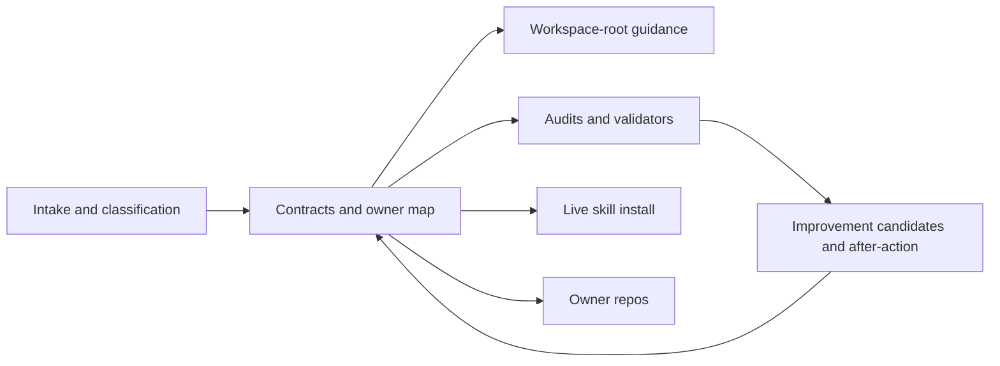
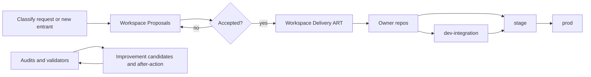

# Workspace Governance

This repository is the cross-repo governance and routing layer for the
`/home/mfshaf7/projects` workspace.

It keeps the shared control model in one place so operators do not have to
reconstruct cross-repo truth from scattered docs and chat history.

At this layer, the important questions are:

- which repo owns the work
- which products and components are part of the governed system
- which workflow or review rule applies
- what evidence is required before the change can be treated as done

The repo carries the machine-readable contract model for the active repo map,
product maturity, component inventory, dependency semantics, review
obligations, security bindings, vocabulary, and self-improvement records.
It also now owns the explicit governance-engine output manifest and the shared
materializer implementation that emits workspace-root files, managed live
skills, and generated governance artifacts from that contract.

The same governance layer owns the intake model for new repos, products, and
components. Nothing needs to be governed by default, but new entrants should
be classified explicitly before they drift into the operator-facing control
plane by accident.

`dev-integration` policy lives here as well. The workspace defines when that
lane is appropriate, what it must never touch, and which artifacts are
required before fast local work can move into governed stage rehearsal. The
concrete runtime shape still belongs to the profile owner.

The same split applies to profile admission. A profile request is not the same
thing as an active profile. Requests may be `proposed`, `active`,
`suspended`, or `retired`, and the admission policy stays generic even when
the current request adapter is a tool such as OpenProject.

The current architecture target for the workspace control plane is also
explicit now:

- the reusable governance-engine layer versus tenant-instance state boundary
- the enterprise control-plane packaging model
- the governed AI runtime foundation and its sequencing rules

Primary architecture surface:

- [docs/governance-engine-foundation.md](docs/governance-engine-foundation.md)

This repo also holds the workspace doctrine for operator workflows, delegated
execution, troubleshooting, and self-improvement. Those controls exist so the
workspace behaves like a deliberate system of record rather than a set of
convenient local habits.

## Architecture At A Glance



This repo is the workspace control plane. It does not deliver products
directly. It decides how the workspace is classified, routed, audited, and
corrected when the control model drifts.

## Workflow At A Glance



Where this repo sits in that flow:

- it governs intake classification before work quietly becomes active
- it governs the transition from proposal tracking into the
  [`Workspace Delivery ART`](https://github.com/mfshaf7/platform-engineering/blob/main/products/openproject/delivery-art-contract.md)
- it does not replace owner repos as implementation truth
- it defines the rules for `dev-integration`, stage discipline, and
  self-improvement when the workflow drifts

If you only need one workflow picture from this repo, use this one. The key
placement is:

- [`Workspace Proposals`](https://github.com/mfshaf7/platform-engineering/blob/main/products/openproject/idea-backlog-contract.md)
  = intake and triage
- [`Workspace Delivery ART`](https://github.com/mfshaf7/platform-engineering/blob/main/products/openproject/delivery-art-contract.md)
  = accepted work and delivery execution
- owner repos = code, runtime changes, and durable implementation

When a change creates or materially changes a workflow that an operator is
expected to run, the owning repo must publish one primary instruction surface.
Supporting contracts and templates can reinforce that workflow, but they do
not replace a clear operator procedure.

For delegated execution, the workspace expects a governed task packet,
disjoint write scope, main-agent-only authority boundaries, and an audit
journal. Parallel work is allowed, but it is not supposed to be improvised.

For deciding where meaningful work belongs before execution, use the
proportional work-home routing contract:

- [docs/work-home-routing-contract.md](docs/work-home-routing-contract.md)

For serious failure diagnosis, the workspace uses one order of operations
instead of symptom-driven debugging:

- preflight
- live truth
- contract truth
- code truth
- workaround gate

Primary operator surfaces:

- [docs/troubleshooting-preflight.md](docs/troubleshooting-preflight.md)
- [docs/delegated-execution.md](docs/delegated-execution.md)

The self-improvement model is no longer only about retrospective closure. It
now combines:

- deterministic signal audit for machine-visible misses
- improvement candidates for fast triage
- after-action reviews for durable closure

- [docs/self-improvement-escalation.md](docs/self-improvement-escalation.md)

If a user explicitly calls out a repeated mistake, that should create or update
an improvement candidate immediately rather than waiting for a later
retrospective.

The same applies when a simpler root cause is discovered only after deeper
debugging expanded. That is not just a debugging anecdote. It is a governed
self-improvement signal that should route through the improvement-candidate and
after-action layers.

Workspace-level Codex GitHub review and the read-only control-plane summary
have their own primary operator surface:

- [docs/codex-github-review-and-automation.md](docs/codex-github-review-and-automation.md)

The skill model follows the same rule. Governing skill source is not enough by
itself. `contracts/skills.yaml` and `skills-src/` must also be installed into
the live Codex skill root under `~/.codex/skills`, and the workspace audit
fails when that live install drifts from the governed source.

For Git-tracked docs outside `workspace-root/`, renderer-safe navigation is
required too. Same-repo docs should use repo-relative links, while cross-repo
navigation should use web-safe links instead of local filesystem markdown
targets.

For the current `dev-integration` request and usage path, that primary surface
is:

- [platform-engineering/docs/runbooks/dev-integration-profiles.md](https://github.com/mfshaf7/platform-engineering/blob/main/docs/runbooks/dev-integration-profiles.md)

AI may assist intake, but an `ai-suggested` intake entry only
counts as governed when it references an active approved model profile from
`platform-engineering` and still records explicit operator acceptance.

## What This Repository Owns

- canonical source for the workspace-root `README.md` and `AGENTS.md`
- canonical source for the workspace-root `ARCHITECTURE.md`
- contract source under `contracts/`
- generated resolved governance artifacts under `generated/`
- workspace-level skill source under `skills-src/`
- governed improvement-candidate triage and after-action review records under `reviews/`
- workspace audit and sync tooling
- cross-repo owner-map and routing conventions
- workspace-level validation that the active repos remain aligned

## What This Repository Does Not Own

- platform manifests, Argo apps, or environment contracts
- product source, runtime packaging, or host-runtime implementation
- repo-local operator runbooks
- security standards or review outputs

Those stay in the owning repos:

- `platform-engineering/`
- `openclaw-runtime-distribution/`
- `openclaw-telegram-enhanced/`
- `openclaw-host-bridge/`
- `security-architecture/`

## Repository Layout

- `workspace-root/`
  - canonical copies of the files synced into `/home/mfshaf7/projects`
  - includes the new-session architecture snapshot at `ARCHITECTURE.md`
- `contracts/`
  - machine-readable repo, product, component, lifecycle, evidence, review, and
    vocabulary contracts plus intake policy, intake register, and
    developer-integration lane contracts
  - includes `governance-engine-foundation.yaml` for the reusable engine
    boundary, packaging model, and runtime-sequencing contract
  - includes `governance-engine-output-manifest.yaml` for the explicit
    materialized-output and emission-boundary contract
- `generated/`
  - resolved owner map, dependency graph, stale-content rules, and system map
  - exact generated outputs are declared in
    `contracts/governance-engine-output-manifest.yaml`
- `skills-src/`
  - workspace-level skill source directories owned here
- `reviews/`
  - improvement-candidate triage records plus after-action closure evidence
- `templates/`
  - scaffolds for new governance objects
- `scripts/`
  - audit, sync, and repo-structure validation helpers
- `.github/`
  - repo ownership and validation workflow metadata

## Operating Model

1. Edit the canonical files in this repo.
2. If workspace-level truth freshness matters, run the remote-alignment
   preflight against `workspace-governance` before relying on local control
   plane guidance.
3. Land meaningful git-tracked changes through a repo branch and pull request
   with a meaningful summary unless the user explicitly asks for direct landing
   or the repo's documented workflow says otherwise.
4. Sync them into the live workspace root.
5. Run repo-local validation.
6. Run the workspace audit against `/home/mfshaf7/projects`.
7. Reinstall or verify the registered skills if skill source or registry state
   changed.
   The real local install under `~/.codex/skills` matters, not just a temp
   validation copy.
8. Validate improvement candidates and learning closure if self-improvement
   records or closure controls changed.
9. If repo ownership or routing changed, update the owning repo docs in the
   same work.

When a structured record is created or edited, validate that exact file before
continuing broader work:

```bash
python3 scripts/validate_structured_record.py <record-path> --workspace-root /home/mfshaf7/projects
```

Use this for improvement candidates, after-actions, delegation journals,
workspace contracts, and owner-repo change records. It exists to stop
memory-authored record mistakes before they turn into repeated validation
failures later in the task.

When the workspace is being described as clean, restart-ready, or post-merge
retired, the stricter branch lifecycle gate must pass too:

```bash
python3 scripts/audit_branch_lifecycle.py --workspace-root /home/mfshaf7/projects --include-remote --check-clean
```

That check is what prevents stale local branches, pinned worktrees, and remote
branches without an open PR or documented exception from lingering after the
real work is already on `main`.

## Sync Model

The workspace root is not a Git repo, but local tools and future sessions still
read these paths directly:

- `/home/mfshaf7/projects/README.md`
- `/home/mfshaf7/projects/AGENTS.md`
- `/home/mfshaf7/projects/ARCHITECTURE.md`
- `/home/mfshaf7/projects/_workspace_tools/audit_workspace_layout.py`

This repo keeps the canonical copies in:

- `workspace-root/ARCHITECTURE.md`
- `workspace-root/README.md`
- `workspace-root/AGENTS.md`
- `scripts/audit_workspace_layout.py`

Use `scripts/sync_workspace_root.py` to materialize the canonical files back
into the workspace root.

A workspace-governance change is not complete until that sync has been run and
the workspace audit passes against the live root.

## Validation

Run these from this repo:

```bash
python3 scripts/sync_workspace_root.py --workspace-root /home/mfshaf7/projects
python3 scripts/validate_repo_structure.py --repo-root .
python3 scripts/validate_contracts.py --repo-root .
python3 scripts/validate_delegation_journal.py --workspace-root /home/mfshaf7/projects
python3 scripts/validate_intake.py --workspace-root /home/mfshaf7/projects
python3 scripts/validate_developer_integration.py --repo-root . --workspace-root /home/mfshaf7/projects
python3 scripts/validate_improvement_candidates.py --workspace-root /home/mfshaf7/projects
python3 scripts/validate_structured_record.py reviews/improvement-candidates/<record>.yaml --workspace-root /home/mfshaf7/projects
python3 scripts/validate_cross_repo_truth.py --workspace-root /home/mfshaf7/projects --write-generated
python3 scripts/validate_security_bindings.py --workspace-root /home/mfshaf7/projects
python3 scripts/validate_component_contracts.py --workspace-root /home/mfshaf7/projects
python3 scripts/validate_review_coverage.py --workspace-root /home/mfshaf7/projects
python3 scripts/validate_security_change_record_lanes.py --workspace-root /home/mfshaf7/projects
python3 scripts/validate_codex_review_controls.py --workspace-root /home/mfshaf7/projects
python3 scripts/audit_improvement_signals.py --workspace-root /home/mfshaf7/projects
python3 scripts/validate_learning_closure.py --workspace-root /home/mfshaf7/projects
python3 scripts/audit_branch_lifecycle.py --workspace-root /home/mfshaf7/projects
python3 scripts/audit_branch_lifecycle.py --workspace-root /home/mfshaf7/projects --include-remote
python3 scripts/audit_branch_lifecycle.py --workspace-root /home/mfshaf7/projects --include-remote --check-clean
python3 scripts/workspace_control_plane_summary.py --workspace-root /home/mfshaf7/projects --refresh-remote
python3 scripts/install_skills.py --workspace-root /home/mfshaf7/projects
python3 scripts/install_skills.py --workspace-root /home/mfshaf7/projects --check
python3 scripts/install_skills.py --workspace-root /home/mfshaf7/projects --target-root /tmp/workspace-skills
python3 scripts/install_skills.py --workspace-root /home/mfshaf7/projects --target-root /tmp/workspace-skills --check
python3 scripts/sync_workspace_root.py --workspace-root /home/mfshaf7/projects --check
python3 scripts/audit_workspace_layout.py --workspace-root /home/mfshaf7/projects
python3 scripts/audit_workspace_layout.py --workspace-root /home/mfshaf7/projects --check-clean
python3 scripts/audit_stale_content.py --workspace-root /home/mfshaf7/projects
python3 -m py_compile scripts/audit_branch_lifecycle.py scripts/audit_workspace_layout.py scripts/audit_stale_content.py scripts/audit_improvement_signals.py scripts/check_remote_alignment.py scripts/contracts_lib.py scripts/install_skills.py scripts/record_after_action.py scripts/record_improvement_candidate.py scripts/scaffold_intake.py scripts/sync_workspace_root.py scripts/validate_codex_review_controls.py scripts/validate_component_contracts.py scripts/validate_contracts.py scripts/validate_cross_repo_truth.py scripts/validate_delegation_journal.py scripts/validate_developer_integration.py scripts/validate_improvement_candidates.py scripts/validate_intake.py scripts/validate_learning_closure.py scripts/validate_repo_structure.py scripts/validate_review_coverage.py scripts/validate_security_bindings.py scripts/validate_security_change_record_lanes.py scripts/validate_structured_record.py scripts/workspace_control_plane_summary.py
```

## Read First

- [AGENTS.md](AGENTS.md)
- [docs/codex-github-review-and-automation.md](docs/codex-github-review-and-automation.md)
- [workspace-root/ARCHITECTURE.md](workspace-root/ARCHITECTURE.md)
- [contracts/README.md](contracts/README.md)
- [contracts/skills.yaml](contracts/skills.yaml)
- [docs/delegated-execution.md](docs/delegated-execution.md)
- [docs/troubleshooting-preflight.md](docs/troubleshooting-preflight.md)
- [reviews/improvement-candidates/README.md](reviews/improvement-candidates/README.md)
- [reviews/after-action/README.md](reviews/after-action/README.md)
- [workspace-root/README.md](workspace-root/README.md)
- [workspace-root/AGENTS.md](workspace-root/AGENTS.md)
- [scripts/README.md](scripts/README.md)
