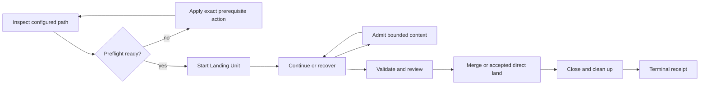

# Console-Complete Delivery ART Lifecycle

This document defines the target operator path for completing governed Delivery
ART work without reconstructing procedure from repository docs or routinely
using a terminal. It extends the existing Delivery ART operator path; it does
not introduce a second workflow engine or a second source of work-state truth.

The target architecture is tracked by Delivery Epic `#1154`. Its durable
schema-v3 Architecture Packet is the machine-readable authority for descendant
ownership, ordering, Landing Units, gates, conformance, and rollback.

## Outcome

The Governance Operations Console becomes the normal operator adapter for the
existing Operator Orchestration Service work-session lifecycle:

1. inspect the current ART item and configured path
2. resolve or explicitly surface every blocking precondition
3. start the exact Landing Unit
4. continue, recover, merge, and close the work through durable commands
5. inspect bounded context, evidence, receipts, and cleanup from the Console

The terminal remains a recovery and diagnostics surface. It is not the normal
way to discover required commands, reconstruct identity, assemble evidence, or
finish routine work.

## Owner Boundaries

| Concern | Authority | Boundary |
| --- | --- | --- |
| Workspace contract and Architecture Packet | `workspace-governance` | Defines ownership and lifecycle rules; performs no runtime mutation. |
| Work-session command and durable workflow state | `operator-orchestration-service` | Owns start, continue, reconstruct, recover, merge, close, exact-next-action, and receipts. |
| Readiness and artifact custody | `workspace-governance-control-fabric` | Evaluates and persists bounded evidence; does not orchestrate work or mutate source. |
| Lifecycle context admission | `context-governance-gateway` | Produces redacted, budgeted operator/model packets; does not become workflow authority. |
| Operator experience | `governance-operations-console` | Displays projections and submits commands to OOS; holds no canonical lifecycle state. |
| Runtime composition and secret references | `platform-engineering` | Commissions runtime identity and secret delivery after the required gates. |
| Trust decision | `security-architecture` | Approves or denies exact-source activation where a later implementation changes trust. |

OpenProject remains the ART work-state authority. Git providers remain source
and review authorities. The Console does not add its own lifecycle database.

## Configured-Path Preflight

`work start` must not discover basic configuration faults after creating a
source session. Before source work begins, OOS produces one deterministic
preflight projection containing:

- ART item, parent Feature, initiative, and current lifecycle posture
- Landing Unit decision and exact owner repository
- architecture packet presence, scope, and supersession status
- branch, base ref, source identity, review identity, and provider capability
- required runtime profiles and non-secret credential references
- required validation scopes, evidence classes, and human gates
- context packet availability and budget posture
- workspace and owner-repo cleanliness relevant to this Landing Unit
- one exact next action for every unmet prerequisite

The result is either `implementation-ready` or a bounded blocker list. It must
not offer a start command while a known prerequisite is unresolved. A missing
agent source-session directory, stale architecture packet, unavailable provider
installation, or absent review capability is therefore a preflight result, not
a late source-work surprise.

Preflight is idempotent and read-only. Applying its next action remains an
explicit command with its own authority and receipt.

## Context Path

CGG becomes the default bounded context path for lifecycle operations whose raw
ART, repository, validation, or runtime output is too large or sensitive for a
normal projection. OOS requests a typed lifecycle packet and receives:

- stable source references and capture metadata
- redaction and classification result
- operator-safe and model-safe projections
- token and size budgets
- content digest and custody receipt
- explicit truncation or unavailable-source signals

OOS remains responsible for deciding what lifecycle action is legal. CGG only
controls admitted context. Generic retrieval infrastructure is deferred until
measured packet misses demonstrate that typed capture and deterministic lookup
are insufficient.

## Console Capability

The Console must project the complete OOS work-session contract rather than a
parallel UI-only workflow. For each active item it must support:

- configured-path status and exact next action
- start and continue
- interruption reconstruction and bounded recovery
- merge readiness and review evidence
- merge execution where the configured authority permits it
- closeout, cleanup, and terminal receipt readback
- command log, bounded context packet, and owner receipt inspection

Every mutation uses same-origin Console routes to OOS. The browser never calls
OpenProject, Git providers, WGCF, CGG, Vault, or platform runtimes directly.
The Console must show source authority, review authority, pending gate, current
state, and terminal outcome without asking the operator to infer them.

## Evidence And Cleanup

Evidence is generated from command receipts and authoritative readback where
possible. The operator confirms decisions and exceptions; the operator is not
expected to hand-author machine facts already known by OOS, WGCF, CGG, Git, or
OpenProject.

A source-backed item may close only after its finalized Review Packet binds the
merged or explicitly accepted source evidence, CI-equivalent validation, and
the covered ART items. Closeout then performs scoped cleanup and records:

- merged head or accepted direct-land reference
- Review Packet and validation receipts
- ART state readback
- retired branch, worktree, session, and disposable runtime resources
- preserved denial, failure, rollback, and audit evidence
- remaining follow-up that belongs to another accepted initiative

Cleanup must be exact to the Landing Unit. It must not use broad workspace
cleanup as a substitute for owner-aware retirement.

## Lifecycle Sequence

Retries reuse deterministic identities. Replay returns the prior durable
receipt. Cancellation and failure preserve the last accepted state and expose
an exact recovery action. No failed command projects success into ART, source,
or the Console.

## Gates And Rollout

The architecture packet for `#1154` is the first gate. It blocks implementation
until ownership, execution order, conformance, and rollback are durable.

Each backlog Feature must then be decomposed into source-backed children and a
superseding packet before implementation. That packet must add any exact
Security or Platform gate required by the real trust boundary. A planning
placeholder cannot be treated as implementation or activation approval.

Rollout order is:

1. configured-path preflight and exact-next-action contract
2. typed CGG lifecycle context path and measurements
3. automated evidence and Landing Unit cleanup
4. complete Console command and status projection
5. Console-only positive, denial, replay, interruption, restart, rollback, and
   cleanup qualification

Rollback disables only the affected adapter, workflow capability, identity, or
Landing Unit. Durable receipts and source history remain available for audit.

## Completion Standard

The initiative is complete only when a representative source-backed ART item
can be inspected, started, continued, recovered, merged, closed, and audited
through the Console without routine terminal use; negative and replay paths
remain truthful; and no component assumes authority owned by another system.
