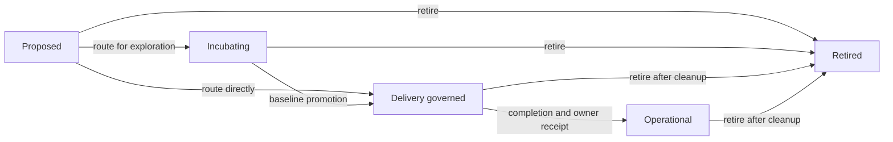
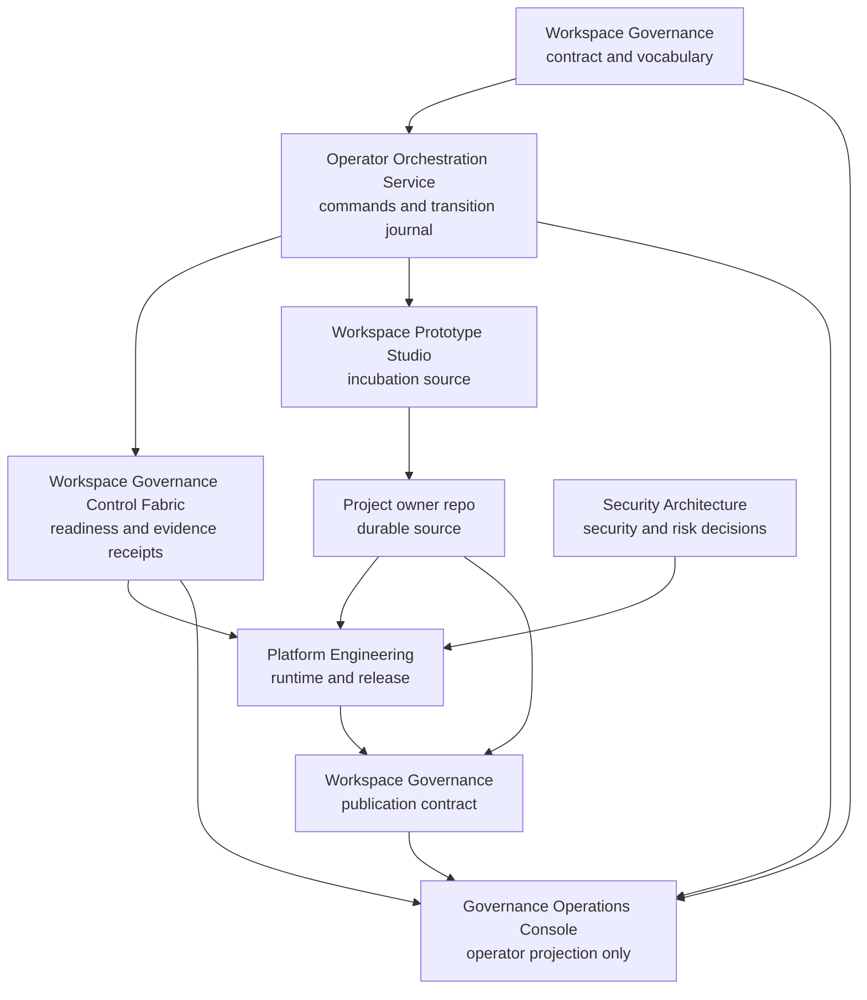
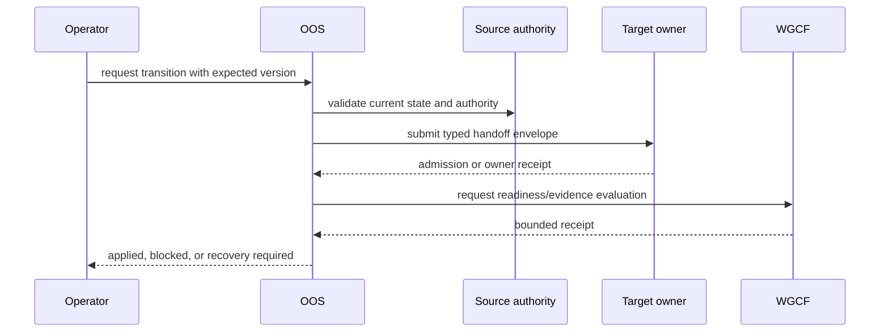

# Governed Project Lifecycle Architecture

This is the human projection of
[`contracts/project-lifecycle.yaml`](../contracts/project-lifecycle.yaml). The
machine-readable contract is authoritative when wording and structure differ.

The model is product-neutral. It does not assume that every project requires a
prototype, a deployed runtime, or portfolio publication. It also does not
create a new runtime control plane.

## The Five Axes

A project has one state on each independent axis:

| Axis | Question answered | Example states |
| --- | --- | --- |
| Project phase | Which governed work context is progressing it? | proposed, incubating, delivery-governed, operational, retired |
| Source custody | Who holds authoritative source? | none, incubation repo, dedicated owner repo, shared owner repo |
| Runtime environment | Where does an admitted runtime exist? | none, local preview, dev-integration, stage, production |
| Release posture | Has a release been governed? | not applicable, unreleased, candidate, released, withdrawn |
| Publication posture | Is the operational result listed, and for whom? | unlisted, internal, client, public, archived |

These axes must not be collapsed into one status. A local preview is not a
release. A repository does not imply runtime admission. A released product is
not automatically published in the portfolio.

The source-custody axis records the kind of source owner. Physical repository
identity and workspace repository custody use the narrower
[`repository-custody.yaml`](../contracts/repository-custody.yaml) contract.
Neither contract implies Workspace Intake or active-inventory admission.

## Primary Flow

Portfolio publication is deliberately absent from this phase graph. It is an
optional publication decision after a project is operational, not a build lane
or substitute owner.

## Authority Map

The Console displays and requests lifecycle work. It is not canonical project,
source, runtime, release, or publication truth.

## Transition Contract

Every allowed transition names:

- the axis and allowed source and target states
- its explicit implementation maturity
- source authority and target owner
- the required typed envelope
- required evidence
- preconditions on the other axes
- allowed recovery decisions

The handoff sequence is:

No failed transition advances durable state. Recovery is explicit:

- `remove`: resolve the blocker and attach resolution evidence
- `workaround`: record justification, owner, and review date
- `accept-risk`: add security decision evidence as well as owner and review date
- `defer`: preserve the current state with justification, owner, and review date

## Stable Route Examples

Direct delivery:

1. A proposal is accepted and routed to `delivery-governed`.
2. Source custody may remain `none` while delivery shapes the work.
3. Before the project can become `operational`, source must move to a dedicated
   or shared durable owner repo.
4. Runtime, release, and publication decisions proceed independently when they
   apply.

Incubation first:

1. A proposal is routed to `incubating`.
2. Workspace Prototype Studio admits the source and may provide a local preview.
3. Baseline promotion moves project phase into governed delivery.
4. Source graduation transfers exact source revision and custody evidence to a
   durable owner repo.
5. Delivery completion may then establish `operational` posture.

Non-deployed product:

1. Delivery completes with durable source custody.
2. Release posture remains `not-applicable` and runtime remains `none` or local.
3. The product may still be listed for an internal, client, or public audience
   when publication evidence is valid.

## Validation Boundary

`scripts/validate_contracts.py` validates schema and semantic ownership truth.
The focused helper in `scripts/project_lifecycle_contract.py` also validates a
complete state vector or a requested transition against the matrix.

It rejects:

- unknown or duplicate owners
- authority assigned to projection-only roles
- unknown states, evidence, envelopes, or recovery decisions
- unsupported transition identifiers
- hidden changes to more than one lifecycle axis
- wrong source authority or target ownership claims
- incomplete typed envelopes, preconditions, or evidence
- implementation claims above the transition's declared maturity
- state vectors that contradict lifecycle invariants

## Deterministic Proof

[`contracts/project-lifecycle-proof.yaml`](../contracts/project-lifecycle-proof.yaml)
defines a representative synthetic product and the positive and negative
scenarios required for local lifecycle proof. The runner in
[`scripts/project_lifecycle_proof.py`](../scripts/project_lifecycle_proof.py)
chains accepted transitions, preserves state after rejection, and emits a
content-addressed receipt for every step.

The generated readiness projection is available in
[`reports/project-lifecycle-baseline-readiness.md`](../reports/project-lifecycle-baseline-readiness.md).
It distinguishes implemented local validation from contract-only adapters and
blocked future wiring. Regenerate it with `--write` and verify it with
`--check`.

## Current Maturity

The transition architecture remains `contract-only`. Its schema, semantic
validator, and deterministic local simulation are implemented and locally
proven, but transition adapters, governed runtime actions, backend fields, and
Console projection wiring are not claimed as live. A passing proof is ready
for baseline review, not evidence of production operation.
