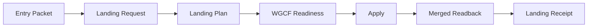

# Prototype Landing Contract

This is the human projection of
[`contracts/prototype-landing.yaml`](../contracts/prototype-landing.yaml). The
machine-readable contract and artifact schemas are authoritative when wording
or structure differs.

Prototype Landing admits one captured entry into Workspace Prototype Studio.
It establishes a stable Prototype identity, accepted name and objective,
support profile, source-custody posture, reviewable source plan, and exact next
action. It does not classify a workspace entrant, approve a baseline, activate
a runtime, transfer repository custody, create Delivery work, grant security
acceptance, or publish a product.

## Boundary

| Concern | Authority |
| --- | --- |
| Contract and vocabulary | Workspace Governance |
| Prototype registry and incubation source | Workspace Prototype Studio |
| Readiness and findings | Workspace Governance Control Fabric |
| Durable command, approval, replay, and receipt | Operator Orchestration Service |
| Preview profile and runtime identity | Platform Engineering |
| Security triggers and acceptance | Security Architecture |
| Operator projection | Governance Operations Console |

Workspace Intake and Prototype Landing are separate. Intake decides whether a
repo, product, or component belongs in the governed workspace. Landing decides
whether a captured prototype entry has enough accepted identity, support, and
source structure to begin incubation. Either may provide context to the other;
neither implies the other's decision.

## Ingress

Landing accepts four ingress classes:

- `direct`
- `proposal-routed`
- `existing-source`
- `imported`

Each ingress produces one immutable Prototype Entry Packet. Upstream titles,
objectives, ownership hints, support choices, and source assumptions remain
suggestions. The operator may rename the Prototype and correct those values
before apply without changing its reserved stable identity.

## Support And Custody

A support profile is a setup shortcut, not a project type. Named profiles
generate locked support rows; `custom` makes the rows operator-defined except
where policy locks an actual blocker. Every request records all ten support
dimensions and distinguishes `unknown`, `not-needed`, `needed`, `ready`, and
`blocked` explicitly.

Source custody is also explicit:

- new, existing Studio, and imported Studio source result in
  `incubation-repo`
- referenced dedicated source remains `dedicated-owner-repo`
- referenced shared source remains `shared-owner-repo`

Reference-only Landing does not copy source or transfer repository custody.
The existing owner remains authority for that referenced source; Prototype
Studio owns only the Prototype record and any source actually under incubation.
Import binds both origin and imported-content digests and makes no trust claim.

## Artifact Chain

Every artifact binds the identifiers and digests it consumes. `Apply` requires
a ready result for the exact request, plan, registry digest, and source
revision. It prepares a non-default-branch source change; it does not merge.
`landed` is true only after merged `main` readback and the terminal receipt
agree.

The typed schemas are:

- `contracts/schemas/prototype-landing-entry-packet.schema.json`
- `contracts/schemas/prototype-landing-request.schema.json`
- `contracts/schemas/prototype-landing-plan.schema.json`
- `contracts/schemas/prototype-landing-readiness.schema.json`
- `contracts/schemas/prototype-landing-apply.schema.json`
- `contracts/schemas/prototype-landing-readback.schema.json`
- `contracts/schemas/prototype-landing-receipt.schema.json`

## Result And Recovery

A successful Landing enters project phase `incubating` with Prototype lifecycle
`exploring`. Its next action is Candidate Promotion. Landing cannot skip ahead
to candidate, baseline-approved, Delivery, runtime, security, or publication
state.

Exact replay returns existing evidence without another source mutation.
Conflicting idempotency, stale source, denied readiness, cancellation, or
failure leaves registry and source truth unchanged. An interrupted write must
reconcile branch and merged authority before retry. Every non-terminal result
names one owner and one actionable next step.

## Current Maturity

This contract is `contract-only`. It defines the authority and machine shapes
required by downstream implementation, but it does not claim that Prototype
Studio source mutation, WGCF evaluation, OOS orchestration, Platform runtime,
Security acceptance, or Console wiring is live. Those capabilities land in
their own reviewed owner-repo changes.
