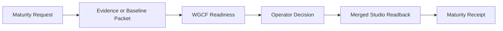

# Prototype Maturity Contract

This is the human projection of
[`contracts/prototype-maturity.yaml`](../contracts/prototype-maturity.yaml). The
machine-readable contract and artifact schemas are authoritative when wording
or structure differs.

Prototype maturity has two local transitions:

- Candidate Promotion moves `exploring` to `candidate`.
- Baseline Promotion moves `candidate` to `baseline-approved`.

Both transitions are owned by Workspace Prototype Studio. They establish
whether a landed Prototype is worth shaping and whether its local design,
workflow, boundaries, and evidence are accepted. They do not move the project
into Delivery or grant authority to another domain.

## Authority

| Concern | Authority |
| --- | --- |
| Contract and vocabulary | Workspace Governance |
| Prototype registry, maturity records, and source readback | Workspace Prototype Studio |
| Readiness and findings | Workspace Governance Control Fabric |
| Durable workflow, approval binding, replay, and receipts | Operator Orchestration Service |
| Security trigger and risk acceptance | Security Architecture |
| Explicit promotion decision | Operator |
| Operator projection | Governance Operations Console |

The Console projects requests, evidence, readiness, decisions, and receipts. It
does not own lifecycle truth. WGCF evaluates readiness but cannot mutate the
Prototype. OOS coordinates the workflow but cannot decide maturity.

## Candidate Promotion

Candidate Promotion is a bounded interview for a landed, exploring Prototype.
It records:

- objective, target user, and expected proof
- accepted scope and non-goals
- owner and source boundary
- data, mutation, and visibility boundaries
- security and governance triggers
- open issues and their disposition

The operator may promote the Prototype, block a real visible issue, or route it
to the separate closeout workflow. A block requires an issue reference, owner,
and required fix. Simply leaving the workflow keeps the Prototype exploring and
does not create a fake decision receipt.

## Baseline Promotion

Baseline Promotion evaluates a candidate using existing Landing, Candidate
Promotion, Preview Runtime, Dashboard, and local receipt evidence. It is not a
second candidate interview.

Its Baseline Packet contains:

- definition, objective, owner, target user, scope, and non-goals
- design profile, surfaces, workflow map, state map, and interaction states
- design review evidence and applicable preview or validation proof
- data, mutation, source, visibility, and integration boundaries
- security and governance triggers
- open issues, risk dispositions, and next intended path

The operator may approve the baseline, block a real visible issue, or route the
Prototype to closeout. Approve is unavailable until the exact packet and source
state are ready.

## Artifact Chain

Every artifact binds the identifiers and digests it consumes. A promote or
approve decision prepares a reviewable non-default-branch source change. The
new lifecycle is true only after merged Prototype Studio readback and the
terminal receipt agree. Replay with the same inputs is idempotent; conflicting
reuse fails closed.

The typed schemas are:

- `contracts/schemas/prototype-maturity-request.schema.json`
- `contracts/schemas/prototype-maturity-packet.schema.json`
- `contracts/schemas/prototype-maturity-readiness.schema.json`
- `contracts/schemas/prototype-maturity-decision.schema.json`
- `contracts/schemas/prototype-maturity-readback.schema.json`
- `contracts/schemas/prototype-maturity-receipt.schema.json`

## Approval Boundary

`baseline-approved` means the operator accepts the local design, workflow,
state model, boundaries, and evidence enough to continue incubation or prepare
a later transition.

It does not mean Delivery admission, ART creation, source graduation, runtime
admission, release approval, security acceptance, client exposure, or Portfolio
publication. Those remain separate owner-controlled workflows.

## Current Maturity

This contract is `contract-only`. The owner implementations land in their own
reviewed changes. This record does not claim that Studio mutation, WGCF
evaluation, OOS orchestration, Security review, or Console projection is live.
