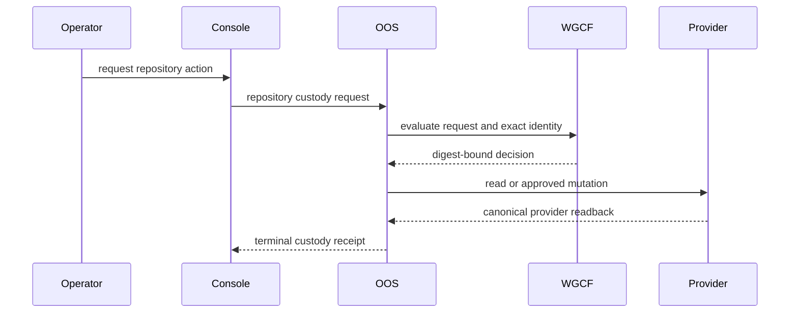

# Repository Identity And Custody

This is the human projection of
[`contracts/repository-custody.yaml`](../contracts/repository-custody.yaml).
The machine-readable contract is authoritative when wording and structure
differ.

Repository custody answers two narrow questions:

1. Which physical provider repository is this?
2. Which workspace owner is accountable for it?

It does not admit a repository into the workspace, add it to active inventory,
link it to Delivery Catalog, create a product, approve a release, or grant
security acceptance.

## Identity

The immutable repository key is `(provider, provider_repository_id)`. Provider
owner, name, URL, default branch, visibility, and archive state are coordinates
obtained from provider readback. Rename and transfer must not create a second
repository identity.

Requests and receipts carry a provider credential-binding reference. They must
never carry a personal access token, installation secret, or other credential
value.

## Authority

| Responsibility | Authority |
| --- | --- |
| Policy and vocabulary | Workspace Governance |
| Request readiness decision | Workspace Governance Control Fabric |
| Workflow, idempotency, adapters, and custody receipt | Operator Orchestration Service |
| Physical repository state and immutable ID | Repository provider |
| Provider application identity and secret delivery | Platform Engineering |
| Trust-boundary acceptance | Security Architecture |
| Operator projection | Governance Operations Console |

The Console requests and displays work. It does not become repository or
workflow authority.

## Evidence Chain

Every terminal path produces a receipt. A denied or failed path may carry a
null provider readback when provider access did not occur or could not
complete. Every successful action that requires provider truth carries a
current digest-bound readback. Provider mutations additionally require an
allowed decision, exact operator approval, and a terminal receipt.

## Actions

- `observe-existing` resolves provider identity without assigning custody.
- `link-existing` records custody for an existing provider repository.
- `provision-new` creates a repository and records custody through one
  idempotent workflow.
- `transfer-custody` changes workspace custody and may coordinate a provider
  transfer when explicitly approved.
- `archive-provider` archives the physical provider repository.
- `retire-workspace-record` retires the workspace custody record without
  asserting provider deletion.

Hard provider deletion is outside contract version 1. A partial successful
provision is recovered through readback and continuation, never by an automatic
compensating delete.

## Replay And Failure

The request ID and request digest form the idempotency binding. Replaying the
same binding returns the existing result. Reusing an ID with another digest is
a conflict. Stale identity or provider version fails closed. Provider
unavailability preserves current custody and emits a failed terminal receipt
that can be retried under the same correlation chain.

## Downstream Boundaries

A successful custody receipt may become input to a later Workspace Intake
request. It performs no downstream transition by itself. Active inventory,
Delivery Catalog linkage, and product admission remain separate explicit
actions owned by their domains.

## Current Maturity

This contract is `contract-only`. Runtime activation remains disabled until
the linked WGCF, OOS, Security, Platform, and Console work under Epic #888 is
merged and evidenced. The first active capability is existing-repository
linkage; provisioning and lifecycle controls follow only after that path is
proven.
