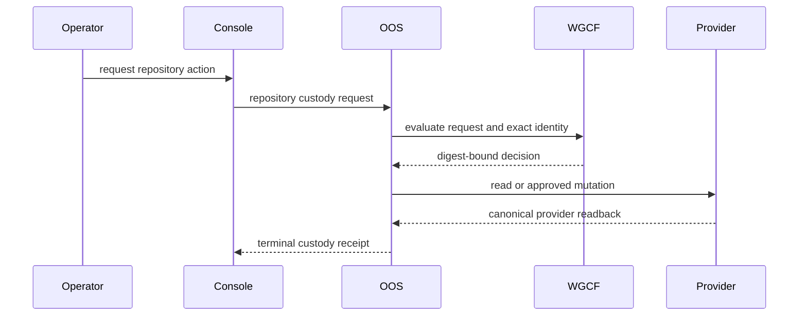

# Repository Identity And Custody

This is the human projection of
[`contracts/repository-custody.yaml`](../contracts/repository-custody.yaml).
The machine-readable contract is authoritative when wording and structure
differ.

Repository custody answers two narrow questions:

1. Which physical provider repository is this?
2. Which workspace owner is accountable for it?

It does not admit a repository into the workspace, add it to active inventory,
link it to Delivery Catalog, create a product, approve a release, or grant
security acceptance.

## Identity

The immutable repository key is `(provider, provider_repository_id)`. Provider
owner, name, URL, default branch, visibility, and archive state are coordinates
obtained from provider readback. Rename and transfer must not create a second
repository identity.

For GitHub, `provider_repository_id` is the positive decimal repository `id`
used by the REST `GET /repositories/{repository_id}` endpoint. It is not the
GraphQL `node_id`, an owner/name pair, or a repository URL. Schemas enforce
that provider-specific format across requests, decisions, readbacks, and
receipts.

Provider reads and mutations carry a provider credential-binding reference.
Workspace-only lifecycle actions carry no provider credential reference. No
artifact may carry a personal access token, installation secret, browser
credential, ambient `gh` session, or other credential value.

## Authority

| Responsibility | Authority |
| --- | --- |
| Policy and vocabulary | Workspace Governance |
| Request readiness decision | Workspace Governance Control Fabric |
| Workflow, idempotency, adapters, and custody receipt | Operator Orchestration Service |
| Physical repository state and immutable ID | Repository provider |
| Provider application identity and secret delivery | Platform Engineering |
| Trust-boundary acceptance | Security Architecture |
| Operator projection | Governance Operations Console |

The Console requests and displays work. It does not become repository or
workflow authority.

## Evidence Chain

Every terminal path produces a receipt. A denied or failed path may carry a
null provider readback when provider access did not occur or could not
complete. Every successful action that requires provider truth carries a
current digest-bound readback. Provider mutations additionally require an
allowed decision, exact operator approval, and a terminal receipt.

Lifecycle actions use a separate request, decision, and receipt family under
this same contract. Workspace-only actions carry a null provider readback.
Archive and unarchive require current provider readback. This separation keeps
the proven link and provision protocol compatible while making lifecycle
evidence unambiguous.

## Custody Acquisition

- `observe-existing` resolves provider identity without assigning custody.
- `link-existing` records custody for an existing provider repository.
- `provision-new` creates a repository and records custody through one
  idempotent workflow.

These actions establish custody. They do not archive, retire, restore, or
transfer an established custody record.

## Lifecycle State

Lifecycle state has three independent axes:

| Axis | States | Authority |
| --- | --- | --- |
| Custody origin | `linked`, `provisioned` | Operator Orchestration Service |
| Provider lifecycle | `active`, `archived`, `unavailable` | Repository provider |
| Workspace record | `active`, `retired` | Operator Orchestration Service |

Keeping these axes separate prevents false claims. Archiving a provider
repository does not retire its workspace record. Retiring a workspace record
does not archive or delete the provider repository. A custody transfer changes
the accountable workspace owner but not provider ownership or repository
identity.

## Lifecycle Actions

- `transfer-workspace-custody` changes only `workspace_owner_ref`. It requires
  exact operator approval plus source-owner and target-owner acceptance.
- `archive-provider` changes provider state from `active` to `archived`. It
  requires the governed provider identity, current provider version, and
  provider readback.
- `unarchive-provider` changes provider state from `archived` to `active`. It
  requires the archive receipt being reversed and the same provider controls.
- `retire-workspace-record` changes workspace-record state from `active` to
  `retired` without provider mutation.
- `restore-workspace-record` changes workspace-record state from `retired` to
  `active` and references the retirement receipt being reversed.

The earlier ambiguous `transfer-custody` action is not valid. Physical provider
ownership transfer and hard provider deletion are outside this contract. A
partial successful provider mutation is recovered through readback and
continuation, never through automatic deletion.

## Impact And Reversal

Every lifecycle request carries a current WGCF impact assessment. It records
the finding count, blocking-finding count, and one explicit blocker disposition
when blockers exist:

- `remove` proves the blocking condition was removed.
- `workaround` binds the accepted bounded workaround evidence.
- `accept-risk` binds explicit risk-acceptance evidence.
- `defer` stops the mutation and returns the request for later action.

No disposition rewrites downstream consumers. Lifecycle completion appends a
terminal receipt. Archive reverses through unarchive, retirement through
restore, and a transfer through another accepted transfer. Reversal references
history and never deletes or replaces it.

## Lifecycle Audit

Audit is a read-only projection, not a lifecycle action. It shows immutable
repository identity, current workspace owner, all three state axes, current
versions, impact summary, latest terminal receipt, and immutable history. Audit
cannot complete, repair, or imply a mutation.

## Provisioning Controls

The first `provision-new` capability is deliberately narrower than the general
provider-neutral custody model. It creates GitHub repositories only inside the
organization bound to the approved GitHub App installation. Personal-account
creation, personal access tokens, and ambient `gh` authentication are not
fallbacks.

The request must explicitly bind:

- organization owner and repository name
- description and visibility
- README initialization
- issues, projects, wiki, and discussions toggles
- squash, merge-commit, and rebase policy
- delete-branch-on-merge policy
- exact operator approval, credential binding, and idempotency identity

Provider defaults do not count as operator intent. An allowed WGCF decision
carries the exact target and settings with `create-provider` as its next action.
Completion requires provider readback of the immutable repository ID, canonical
coordinates, initialized state, visibility, features, and merge policy. Any
mismatch fails closed.

If the create response is lost or readback is interrupted, OOS reconciles the
original request through canonical organization/name coordinates before it may
retry. It never deletes a repository as automatic compensation and never sends
a blind second create request.

## Replay And Failure

The request ID and request digest form the idempotency binding. Replaying the
same binding returns the existing result. Reusing an ID with another digest is
a conflict. Stale identity or provider version fails closed. Provider
unavailability preserves current custody and emits a failed terminal receipt
that can be retried under the same correlation chain.

## Downstream Boundaries

A successful custody receipt may become input to a later Workspace Intake
request. It performs no downstream transition by itself. Active inventory,
Delivery Catalog linkage, and product admission remain separate explicit
actions owned by their domains.

## Current Maturity

This contract is `contract-only`. Existing-repository linkage and provisioning
retain their own activation evidence. Repository lifecycle activation remains
disabled until Platform provider authority, Security acceptance, WGCF
readiness, OOS workflow, and Console integration under Feature #915 are merged
and evidenced. Defining lifecycle schemas does not activate provider mutation.
