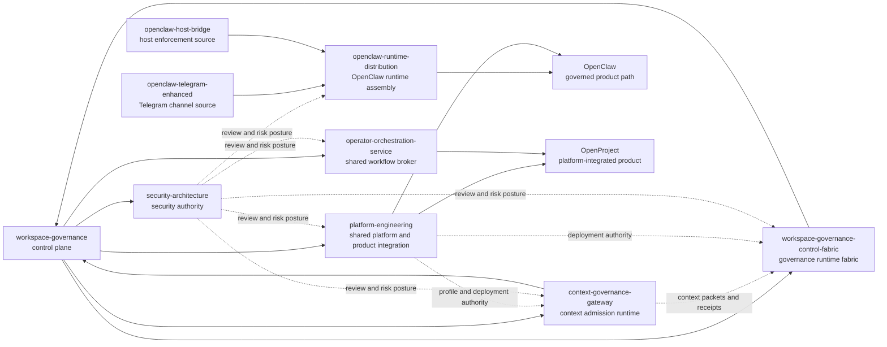
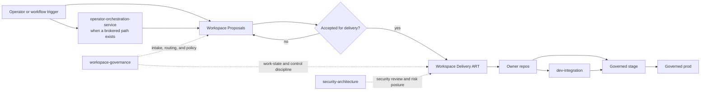

# Projects Workspace

> Canonical source: `workspace-governance/workspace-root/README.md`
>
> This file is synced into `/home/mfshaf7/projects/README.md` by
> `workspace-governance/scripts/sync_workspace_root.py`.

This workspace is the operator-facing multi-repo source of truth for the
current platform and product stack.

Use it to answer three things quickly:

- what the workspace currently governs
- which repo owns the change
- which product or control plane you should read next

Treat it as a governed system, not a loose folder of related repos.

For immediate new-session architecture orientation, read
[ARCHITECTURE.md](/home/mfshaf7/projects/ARCHITECTURE.md) before diving into
individual repos.

## Architecture At A Glance



Read this as the workspace control map:

- `workspace-governance` defines routing, contracts, and audit.
- the current governance-engine boundary, packaging model, and governed AI
  runtime-sequencing source live in
  [workspace-governance/docs/governance-engine-foundation.md](/home/mfshaf7/projects/workspace-governance/docs/governance-engine-foundation.md)
- `workspace-governance-control-fabric` implements the governance runtime
  fabric and consumes workspace governance truth without owning that truth.
- `context-governance-gateway` implements operational context admission and
  context-packet generation; service mode remains blocked behind proposed
  `dev-integration`, platform, and security gates.
- `security-architecture` governs security decisions and evidence.
- `platform-engineering` owns the shared platform plus product integration.
- OpenClaw is assembled through `openclaw-runtime-distribution`.
- OpenProject stays platform-integrated and doubles as the workflow system of
  record.
- `operator-orchestration-service` is the shared broker that crosses product
  boundaries.

## Workflow At A Glance



Read this as the workflow path:

- `Workspace Proposals` is the intake and triage plane.
- `Workspace Delivery ART` is the execution-of-record once work is accepted.
- owner repos still hold implementation truth.
- `dev-integration` is the fast local lane before governed rehearsal.
- `stage` and `prod` remain platform-governed runtime lanes.

## Active Repository Roles

| Repository | Current role | Owns | Does not own |
| --- | --- | --- | --- |
| `workspace-governance/` | Workspace control plane | workspace-root guidance, cross-repo routing, workspace audit tooling | platform rollout, product delivery, security standards |
| `workspace-governance-control-fabric/` | Governance runtime fabric | governance graph, validation planning runtime, admission/readiness/receipt/ledger implementation, control-fabric API/worker/CLI | workspace contracts, workspace-root guidance, platform deployment authority, security standards |
| `context-governance-gateway/` | Context admission runtime implementation | context capture, redaction, projection, model-safe/operator-safe packets, receipts, artifact digests, local ledger behavior, future service implementation after runtime admission | workspace contracts, WGCF readiness, ART mutation, platform release authority, security acceptance, custom LLM/scanner/storage/observability backends |
| `platform-engineering/` | Release and platform authority | environment contracts, pinned SHAs, image digests, Argo state, shared component docs, product integration runbooks | Telegram behavior, bridge implementation, security governance |
| `openclaw-runtime-distribution/` | Active OpenClaw runtime composition | bundled runtime assembly, packaging checks, active `host-control-openclaw-plugin` package, runtime-required workspace templates | environment approval, Argo state, host runtime policy |
| `openclaw-telegram-enhanced/` | Canonical Telegram source | Telegram UX, routing, approvals, media delivery behavior, Telegram-specific tests | host enforcement, platform rollout, security governance |
| `openclaw-host-bridge/` | Canonical host enforcement runtime | allowed roots, typed host operations, audit logs, staging, host-side health and attestation, WSL/Windows bridge behavior | Telegram UX, image composition, GitOps rollout |
| `security-architecture/` | Security governance owner | standards, trust-boundary judgment, review methodology, findings, ADRs, remediation direction | rollout implementation, product packaging, operator runbooks |
| `operator-orchestration-service/` | Shared operator workflow service | shared workflow APIs, workflow audit/correlation, bounded AI-assist orchestration, OpenProject workflow adapters | Telegram delivery/chat UX, platform rollout authority, security standards |

## Retired Repository

- `openclaw-isolated-deployment/`
  - retired to an archival stub
  - not part of the current governed build, promotion, or owner-routing model

## Current Workspace Runtime And Delivery Paths

The workspace is not centered on one product. It currently has four important
paths:

- shared platform and control plane
  - [platform-engineering](/home/mfshaf7/projects/platform-engineering/README.md)
    owns shared environment contracts, Argo state, release truth, and product
    integration surfaces
  - [workspace-governance](/home/mfshaf7/projects/workspace-governance/README.md)
    owns the routing, contract, audit, and self-improvement control plane
  - [workspace-governance-control-fabric](/home/mfshaf7/projects/workspace-governance-control-fabric/README.md)
    owns the admitted runtime implementation path for the governance control
    fabric
  - [context-governance-gateway](/home/mfshaf7/projects/context-governance-gateway/README.md)
    owns context admission implementation and proposed service-mode profile
    shape, while service mode remains blocked behind admission gates
  - [security-architecture](/home/mfshaf7/projects/security-architecture/README.md)
    owns trust-boundary judgment, security standards, and review posture
- OpenClaw
  - fully governed product path with source ownership in the canonical product
    repos, runtime composition in
    [openclaw-runtime-distribution](/home/mfshaf7/projects/openclaw-runtime-distribution/README.md),
    governed stage rehearsal, readiness approval, and prod promotion through
    [platform-engineering/products/openclaw](/home/mfshaf7/projects/platform-engineering/products/openclaw/README.md)
- OpenProject
  - platform-integrated product path with runtime, access, and operator
    procedures in
    [platform-engineering/products/openproject](/home/mfshaf7/projects/platform-engineering/products/openproject/README.md)
  - execution-of-record for delivery work through the
    [Workspace Delivery ART](/home/mfshaf7/projects/platform-engineering/products/openproject/delivery-art-contract.md)
- shared operator workflow service
  - [operator-orchestration-service](/home/mfshaf7/projects/operator-orchestration-service/README.md)
    owns broker-backed operator workflows, delivery-control APIs, and
    OpenProject workflow adapters that span product boundaries
  - broad runtime rehearsal and restore requests should be classified as
    `product-runtime-drill`, `active-stack-runtime-drill`,
    `environment-complete-runtime-drill`, or `lifecycle-control-drill` and
    routed to the shared platform drill workflow instead of defaulting to the
    most mature product-only path

## Current Product Surfaces

- OpenClaw
  - product integration, runbooks, and release workflow:
    [platform-engineering/products/openclaw/README.md](/home/mfshaf7/projects/platform-engineering/products/openclaw/README.md)
- OpenProject
  - product integration, access, and operations guidance:
    [platform-engineering/products/openproject/README.md](/home/mfshaf7/projects/platform-engineering/products/openproject/README.md)
- Shared operator workflows
  - broker-backed workflow APIs and delivery-control surfaces:
    [operator-orchestration-service/README.md](/home/mfshaf7/projects/operator-orchestration-service/README.md)
  - shared active-stack runtime drill and restore:
    [platform-engineering/docs/runbooks/active-stack-runtime-drill.md](https://github.com/mfshaf7/platform-engineering/blob/main/docs/runbooks/active-stack-runtime-drill.md)

## Workspace Governance And Audit

`workspace-governance/` owns the canonical workspace-root files plus the
machine-readable contract model for the active repo map, product maturity,
component inventory, vocabulary, and cross-repo routing rules.

The same repo governs the workspace self-improvement loop:

- machine-visible signal audit
- improvement-candidate triage
- after-action closure

Primary operator surface:

- [workspace-governance/docs/self-improvement-escalation.md](/home/mfshaf7/projects/workspace-governance/docs/self-improvement-escalation.md)

New repos, products, and components enter through the same intake gate and
should be classified before they become part of the governed model:

- `out-of-scope`
- `proposed`
- `admitted`

That keeps expansion explicit instead of letting it happen by drift.

AI may assist intake classification later, but that suggestion only counts as
governed when it references an active approved model profile from
`platform-engineering` and the operator still records explicit acceptance.

The workspace also defines `dev-integration` for fast local iteration. Use it
when operator-facing workflow design or cross-repo API work is still changing
too quickly for governed stage rehearsal. It is standardized at the workspace
level, but it is not a governed delivery lane:

- `workspace-governance` defines when to use it and what it must never touch
- `platform-engineering` owns the shared local-k3s runner
- the owner repo supplies the concrete profile
- local branch, worktree, and dirty-state inputs are allowed there
- stage still requires reviewed commits and the normal governed path

Those local branch and worktree inputs are allowed only while the iteration is
active. Once a repo or the workspace is being described as clean or
restart-ready, the WGCF clean-state scope must pass so stale branches, pinned
worktrees, and remote branches without an open PR or documented exception do
not linger behind the real work. Direct branch-lifecycle or workspace-layout
commands are rollback paths; if WGCF cannot run them, record the blocker or
defect before using a direct command as final evidence.

Session handoffs are local restart-continuity state. Use only
`workspace-governance/docs/archive/session-handoff-current.md`, keep zero or
one handoff at a time, and remove stale handoffs when the checkpoint is no
longer current.

`dev-integration` profiles also have a lifecycle now:

- `proposed`
- `active`
- `suspended`
- `retired`

Only `active` profiles are self-serve launchable from the shared runner. The
request/admission model is generic at the workspace layer, even if the current
request surface adapter is a specific tool such as OpenProject.

For operator-facing workflow changes, the owning repo must publish one clear
operator instruction surface. Supporting contracts and templates do not count
as the primary procedure by themselves. For `dev-integration`, operators
should use the shared runbook in
[platform-engineering/docs/runbooks/dev-integration-profiles.md](https://github.com/mfshaf7/platform-engineering/blob/main/docs/runbooks/dev-integration-profiles.md).

The same principle applies to self-improvement. Do not wait for a later
retrospective if a repeated miss is already obvious. If the user explicitly
calls out a repeated mistake, or if the machine-visible audit detects a
doctrine or completion gap, create or update an improvement candidate first.
Then decide whether the lesson needs a full after-action review.

Troubleshooting follows one supported order of operations:

- preflight
- live truth
- contract truth
- code truth
- workaround gate

Primary operator surface:

- [/home/mfshaf7/projects/workspace-governance/docs/troubleshooting-preflight.md](/home/mfshaf7/projects/workspace-governance/docs/troubleshooting-preflight.md)

Before proposing a new workspace-level control, workflow, validator, skill,
product surface, or architecture capability, use:

- [/home/mfshaf7/projects/workspace-governance/docs/recommendation-preflight.md](/home/mfshaf7/projects/workspace-governance/docs/recommendation-preflight.md)

That preflight forces a `reuse`, `extend`, `replace`, or `new` decision after
checking existing contracts, skills, repo-rule surfaces, and dev-integration
profiles.

This also applies when the operator calls the work half-baked or says the miss
should have been caught already. Those are mandatory self-improvement signals,
not optional tone. If active work becomes half-finished at the planning,
control, or completion layer, the system should record or update the candidate
before continuing normal execution. If a previously closed lesson regresses,
the new candidate should link back to the earlier closed candidate or
after-action instead of treating the miss as brand-new.

If a simpler root cause is discovered only after deeper debugging expanded, that
is also a governed self-improvement signal. It should not stay an anecdote
about a slow debugging session.

The skill layer is governed too. Updating skill source is not enough by itself.
If the registered skill inventory or workspace-owned skill source changes, the
live installed skills under `~/.codex/skills` must be refreshed so future
sessions actually use the new instructions. The workspace audit now checks that
live install state directly.

The root copies remain materialized in `/home/mfshaf7/projects` because local
tooling and future sessions read those entrypoints directly.

Supported audit entrypoint:

```bash
python3 /home/mfshaf7/projects/_workspace_tools/audit_workspace_layout.py --workspace-root /home/mfshaf7/projects
```

Supported remote-freshness preflight entrypoint:

```bash
python3 /home/mfshaf7/projects/workspace-governance/scripts/check_remote_alignment.py --workspace-root /home/mfshaf7/projects --repo-name workspace-governance --refresh-remote
```

Supported stale-content audit entrypoint:

```bash
python3 /home/mfshaf7/projects/workspace-governance/scripts/audit_stale_content.py --workspace-root /home/mfshaf7/projects
```

Supported branch-lifecycle audit entrypoints:

```bash
python3 /home/mfshaf7/projects/workspace-governance/scripts/audit_branch_lifecycle.py --workspace-root /home/mfshaf7/projects
python3 /home/mfshaf7/projects/workspace-governance/scripts/audit_branch_lifecycle.py --workspace-root /home/mfshaf7/projects --include-remote
wgcf catalog check --workspace-root /home/mfshaf7/projects --scope authority:workspace-clean-state --profile dev-integration --tier scoped --operator-approved
```

The remote-aware modes require authenticated `gh` access because the workspace
distinguishes an open-PR branch from stale remote residue.

Supported contract validation entrypoints:

```bash
python3 /home/mfshaf7/projects/workspace-governance/scripts/validate_contracts.py --repo-root /home/mfshaf7/projects/workspace-governance
python3 /home/mfshaf7/projects/workspace-governance/scripts/validate_intake.py --workspace-root /home/mfshaf7/projects
python3 /home/mfshaf7/projects/workspace-governance/scripts/validate_developer_integration.py --repo-root /home/mfshaf7/projects/workspace-governance --workspace-root /home/mfshaf7/projects
python3 /home/mfshaf7/projects/workspace-governance/scripts/validate_cross_repo_truth.py --workspace-root /home/mfshaf7/projects --check-generated
```

Supported learning-closure validation entrypoint:

```bash
python3 /home/mfshaf7/projects/workspace-governance/scripts/validate_learning_closure.py --workspace-root /home/mfshaf7/projects
```

Supported improvement-candidate validation entrypoint:

```bash
python3 /home/mfshaf7/projects/workspace-governance/scripts/validate_improvement_candidates.py --workspace-root /home/mfshaf7/projects
```

Supported proactive signal audit entrypoint:

```bash
python3 /home/mfshaf7/projects/workspace-governance/scripts/audit_improvement_signals.py --workspace-root /home/mfshaf7/projects
```

Supported live-skill sync entrypoints:

```bash
python3 /home/mfshaf7/projects/workspace-governance/scripts/install_skills.py --workspace-root /home/mfshaf7/projects
python3 /home/mfshaf7/projects/workspace-governance/scripts/install_skills.py --workspace-root /home/mfshaf7/projects --check
```

Supported read-only control-plane summary entrypoint:

```bash
python3 /home/mfshaf7/projects/workspace-governance/scripts/workspace_control_plane_summary.py --workspace-root /home/mfshaf7/projects --refresh-remote
```

## Start Here

- Architecture snapshot for new sessions:
  [ARCHITECTURE.md](/home/mfshaf7/projects/ARCHITECTURE.md)
- Codex GitHub review and control-plane summary procedure:
  [workspace-governance/docs/codex-github-review-and-automation.md](/home/mfshaf7/projects/workspace-governance/docs/codex-github-review-and-automation.md)
- Workspace routing: [AGENTS.md](/home/mfshaf7/projects/AGENTS.md)
- Workspace governance repo: [workspace-governance/README.md](/home/mfshaf7/projects/workspace-governance/README.md)
- Workspace governance control fabric:
  [workspace-governance-control-fabric/README.md](/home/mfshaf7/projects/workspace-governance-control-fabric/README.md)
- Context governance gateway:
  [context-governance-gateway/README.md](/home/mfshaf7/projects/context-governance-gateway/README.md)
- Workspace contracts: [workspace-governance/contracts/README.md](/home/mfshaf7/projects/workspace-governance/contracts/README.md)
- Governance-engine foundation: [workspace-governance/docs/governance-engine-foundation.md](/home/mfshaf7/projects/workspace-governance/docs/governance-engine-foundation.md)
- Troubleshooting doctrine: [workspace-governance/docs/troubleshooting-preflight.md](/home/mfshaf7/projects/workspace-governance/docs/troubleshooting-preflight.md)
- Workspace audit: [_workspace_tools/audit_workspace_layout.py](/home/mfshaf7/projects/_workspace_tools/audit_workspace_layout.py)
- Platform authority: [platform-engineering/README.md](/home/mfshaf7/projects/platform-engineering/README.md)
- Dev-integration request and usage: [platform-engineering/docs/runbooks/dev-integration-profiles.md](https://github.com/mfshaf7/platform-engineering/blob/main/docs/runbooks/dev-integration-profiles.md)
- OpenClaw platform model: [platform-engineering/products/openclaw/architecture-and-owner-model.md](/home/mfshaf7/projects/platform-engineering/products/openclaw/architecture-and-owner-model.md)
- OpenProject platform model: [platform-engineering/products/openproject/README.md](/home/mfshaf7/projects/platform-engineering/products/openproject/README.md)
- Shared operator workflow service: [operator-orchestration-service/README.md](/home/mfshaf7/projects/operator-orchestration-service/README.md)
- Active OpenClaw runtime composition: [openclaw-runtime-distribution/README.md](/home/mfshaf7/projects/openclaw-runtime-distribution/README.md)
- Canonical Telegram source: [openclaw-telegram-enhanced/README.md](/home/mfshaf7/projects/openclaw-telegram-enhanced/README.md)
- Canonical host bridge: [openclaw-host-bridge/README.md](/home/mfshaf7/projects/openclaw-host-bridge/README.md)
- Security governance: [security-architecture/README.md](/home/mfshaf7/projects/security-architecture/README.md)
